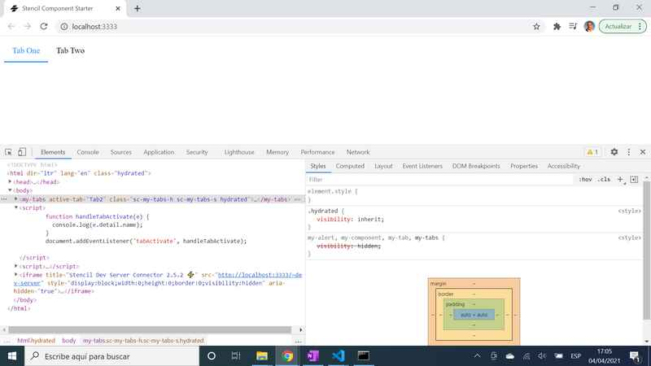

# :zap: Ionic Stencil Tutorial

* Stencil component to study shadow css and create a simple tab menu that highlights active tab
* **Note:** to open web links in a new window use: _ctrl+click on link_


## :page_facing_up: Table of contents

* [:zap: Stencil Component Tutorial](#zap-stencil-component-tutorial)
  * [:page_facing_up: Table of contents](#page_facing_up-table-of-contents)
  * [:books: General info](#books-general-info)
  * [:camera: Screenshots](#camera-screenshots)
  * [:signal_strength: Technologies](#signal_strength-technologies)
  * [:floppy_disk: Setup](#floppy_disk-setup)
  * [:flashlight: Testing](#flashlight-testing)
  * [:computer: Code Examples](#computer-code-examples)
  * [:cool: Features](#cool-features)
  * [:clipboard: Status & To-Do List](#clipboard-status--to-do-list)
  * [:clap: Inspiration](#clap-inspiration)
  * [:file_folder: License](#file_folder-license)
  * [:envelope: Contact](#envelope-contact)

## :books: General info

* "Shadow DOM is an API built into the browser that allows for DOM encapsulation and style encapsulation. ... This means that we do not need to be concerned about scoping our CSS correctly, nor worry about our internal DOM being interfered with by anything outside our component."
* The shadow css is made visible using a boolean settings then running `npm start --prod`. It did not work in Internet Explorer, only Google Chrome
* scoped set to true instead of shadow dom.
* changing state of component makes it re-render

## :camera: Screenshots



## :signal_strength: Technologies

* [Stencil v2](https://stenciljs.com/) a Web Component compiler for building fast, reusable UI components and static site generated Progressive Web Apps
* [Stencil component lifecycle](https://stenciljs.com/docs/component-lifecycle) ComponentDidLoad used

## :floppy_disk: Setup

* Install dependencies by running `npm i`
* `npm start` to see app on local server - `http://localhost:3333/`
* `npm run build` for a production build of the app

## :flashlight: Testing

* `npm test` to run the unit tests once
* `npm run test.watch` to run the unit tests and watch for file changes during development
* `https://www.webpagetest.org/easy` with the `Run Lighthouse Audit` option turned on. This will give you an in depth look into your app's load performance on the average device connected to the average network.
For more info on how to use webpagetest check out [this article](https://zoompf.com/blog/2015/07/the-seo-experts-guide-to-web-performance-using-webpagetest-2)

## :computer: Code Examples

* extract from `` tba

```typescript
  // change class of tab heading depending on if tab is clicked on (thereby creating a tabActivate event)
  @Prop({mutable: true}) activeTab: string;
  @Watch('activeTab')
  handleActiveTabChange(newValue: string) {
    const headings = this.getHeadings();
    headings.forEach(heading => {
      if (heading.name === newValue) {
        heading.active = true;
      } else {
        heading.active = false;
      }
    })
  }
```

## :cool: Features

* Stencil Bundle size
* Stencil component re-usablity: Because web components are built into the browser they can be used anywhere, in any framework or with no framework at all.

## :clipboard: Status & To-Do List

* Status: Complete
* To-Do: Use a Stencil sandbox

## :clap: Inspiration

* [Stencil documentation](https://stenciljs.com/docs/my-first-component)
* [Carl Rippon, StencilJS fundamentals](https://www.youtube.com/watch?v=SCB3X2ApYWc)

## :file_folder: License

* This project is licensed under the terms of the MIT license.

## :envelope: Contact

* Repo created by [ABateman](https://github.com/AndrewJBateman), email: gomezbateman@yahoo.com
